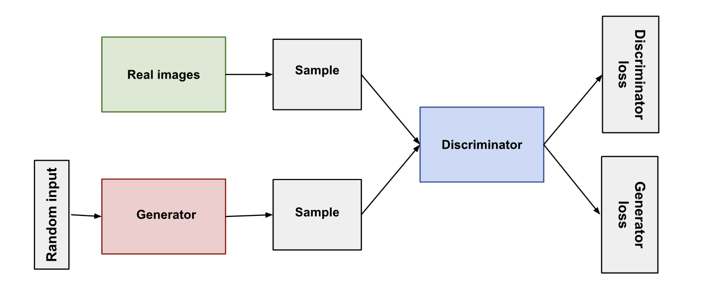

# GAN for Celebrity Face Generation

This project implements a Generative Adversarial Network (GAN) to generate realistic celebrity faces using the [CelebA dataset](https://mmlab.ie.cuhk.edu.hk/projects/CelebA.html). The GAN is trained on high-quality images of celebrities and is capable of synthesizing new face images.

---

## Features

- **Custom Data Loader**: Handles the CelebA dataset, including image transformations and loading.
- **GAN Architecture**: Includes both Generator and Discriminator networks.
- **Training Pipeline**: Optimized training with progress tracking and intermediate image generation.
- **Device Support**: Compatible with CPUs, GPUs, and Apple Silicon's MPS (Metal Performance Shaders).

---

## Install requirements

```bash
pip install -r requirements.txt
```

## Dataset

The project uses the CelebA dataset, which contains over 200,000 celebrity images with rich attribute annotations.

### How to Download the Dataset

The dataset is downloaded automatically using the `kagglehub` library. Example:

```python
import kagglehub
path = kagglehub.dataset_download("jessicali9530/celeba-dataset")
```

## GAN Architecture

The Generative Adversarial Network consists of two primary components: the Generator and the Discriminator.


### Generator

The Generator takes random noise as input and generates a realistic image. Below is the architecture:

```python
class Generator(nn.Module):
    def __init__(self, nz=100, ngf=64, nc=3):
        super(Generator, self).__init__()
        self.main = nn.Sequential(
            # Input is the latent vector Z
            nn.ConvTranspose2d(nz, ngf * 8, 4, 1, 0, bias=False),
            nn.BatchNorm2d(ngf * 8),
            nn.ReLU(True),
            # State size: (ngf*8) x 4 x 4
            nn.ConvTranspose2d(ngf * 8, ngf * 4, 4, 2, 1, bias=False),
            nn.BatchNorm2d(ngf * 4),
            nn.ReLU(True),
            # State size: (ngf*4) x 8 x 8
            nn.ConvTranspose2d(ngf * 4, ngf * 2, 4, 2, 1, bias=False),
            nn.BatchNorm2d(ngf * 2),
            nn.ReLU(True),
            # State size: (ngf*2) x 16 x 16
            nn.ConvTranspose2d(ngf * 2, ngf, 4, 2, 1, bias=False),
            nn.BatchNorm2d(ngf),
            nn.ReLU(True),
            # State size: (ngf) x 32 x 32
            nn.ConvTranspose2d(ngf, nc, 4, 2, 1, bias=False),
            nn.Tanh()
            # Output size: nc x 64 x 64
        )

    def forward(self, input):
        return self.main(input)
```
### Discriminator

The Discriminator distinguishes between real and generated images. Here’s the architecture:

```python
class Discriminator(nn.Module):
    def __init__(self, nc=3, ndf=64):
        super(Discriminator, self).__init__()
        self.main = nn.Sequential(
            # Input size: nc x 64 x 64
            nn.Conv2d(nc, ndf, 4, 2, 1, bias=False),
            nn.LeakyReLU(0.2, inplace=True),
            # State size: (ndf) x 32 x 32
            nn.Conv2d(ndf, ndf * 2, 4, 2, 1, bias=False),
            nn.BatchNorm2d(ndf * 2),
            nn.LeakyReLU(0.2, inplace=True),
            # State size: (ndf*2) x 16 x 16
            nn.Conv2d(ndf * 2, ndf * 4, 4, 2, 1, bias=False),
            nn.BatchNorm2d(ndf * 4),
            nn.LeakyReLU(0.2, inplace=True),
            # State size: (ndf*4) x 8 x 8
            nn.Conv2d(ndf * 4, ndf * 8, 4, 2, 1, bias=False),
            nn.BatchNorm2d(ndf * 8),
            nn.LeakyReLU(0.2, inplace=True),
            # State size: (ndf*8) x 4 x 4
            nn.Conv2d(ndf * 8, 1, 4, 1, 0, bias=False),
            nn.Sigmoid()
        )

    def forward(self, input):
        return self.main(input).view(-1)
```
## Training Objective

The training process involves two competing networks: the Generator and the Discriminator. Each has its own loss function and role in the GAN.

### Generator Loss

The goal of the Generator is to produce images that can fool the Discriminator. It minimizes the following loss:

**Formula**:
\[
\mathcal{L}_G = -\mathbb{E}_{z \sim p_z(z)} [\log(D(G(z)))]
\]

- **Explanation**:
  - \( G(z) \): The generated image from a random noise vector \( z \).
  - \( D(G(z)) \): The probability assigned by the Discriminator that the generated image is real.

- This loss encourages the Generator to produce images that are more likely to be classified as real by the Discriminator.

### Discriminator Loss

The Discriminator’s goal is to correctly classify real images as real and fake images as fake. Its loss is defined as:

**Formula**:
\[
\mathcal{L}_D = -\mathbb{E}_{x \sim p_{data}(x)} [\log(D(x))] - \mathbb{E}_{z \sim p_z(z)} [\log(1 - D(G(z)))]
\]

- **Explanation**:
  - \( D(x) \): The probability that a real image \( x \) is real.
  - \( 1 - D(G(z)) \): The probability that a generated image \( G(z) \) is fake.

- The Discriminator tries to maximize the probability of correctly classifying both real and fake images.

### Training Process

1. **Update the Discriminator**:
   - Train the Discriminator to maximize its ability to distinguish between real and fake images.

2. **Update the Generator**:
   - Train the Generator to minimize its loss by generating images that can fool the Discriminator.

3. **Optimization**:
   - Use alternating updates between the Generator and Discriminator with optimizers like Adam.

4. **Stability**:
   - Techniques like Wasserstein loss with gradient penalty or label smoothing are used to stabilize training and avoid mode collapse.

